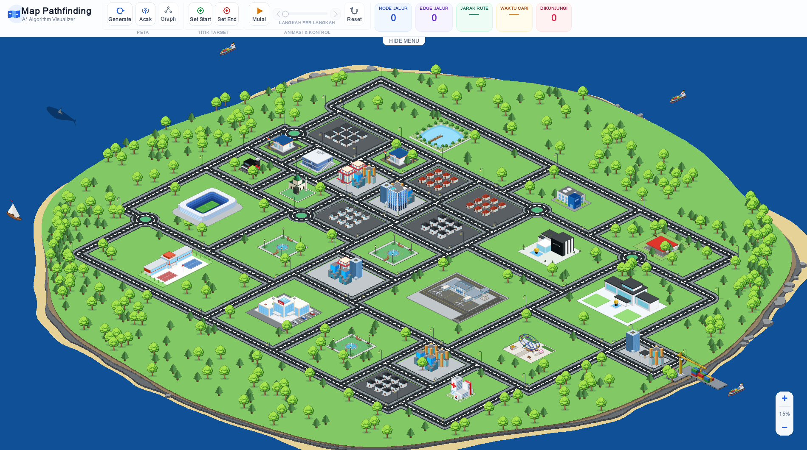

# 🗺️ A* Pathfinding Visualizer

<div align="center">



<br/>
<br/>

<h1>
  🗺️ A* Pathfinding Visualizer
</h1>

<p><em>Watch the algorithm think — on a procedurally generated isometric island city</em></p>

<br/>

[](https://www.python.org/)
[](https://www.pygame.org/)
[](https://github.com)
[](tests/)

<br/>

</div>

---

## ✨ What Is This?

A real-time **A* pathfinding visualizer** built on top of a fully **procedurally generated isometric city**. Every time you press *Generate*, a new island city is born — complete with roads, buildings, parks, harbors, and a road network graph. Then you drop a start point, drop an end point, and watch A* explore the graph live, step by step, before a car drives the final route.

> No two maps are the same. No two routes are the same.

<br/>

---

## 🚀 Getting Started

### Prerequisites

| Requirement       | Version             | Notes                    |
| ----------------- | ------------------- | ------------------------ |
| Python            | 3.10 or higher      | Download from python.org |
| pip               | bundled with Python | —                        |
| Screen resolution | 1280 × 800 minimum  | Window is resizable      |

---

### 🖥️ Windows

**Step 1 — Clone or download this repository**

```bash
git clone https://github.com/your-username/Pathfinding-Algorithm.git
cd Pathfinding-Algorithm
```

**Step 2 — (Recommended) Create a virtual environment**

```bash
python -m venv venv
venv\Scripts\activate
```

**Step 3 — Install dependencies**

```bash
pip install -r requirements.txt
```

**Step 4 — Run**

```bash
python main.py
```

---

### 🐧 Linux

**Step 1 — Clone the repository**

```bash
git clone https://github.com/your-username/Pathfinding-Algorithm.git
cd Pathfinding-Algorithm
```

**Step 2 — Create a virtual environment (recommended)**

```bash
python3 -m venv venv
source venv/bin/activate
```

**Step 3 — Install dependencies**

```bash
pip install -r requirements.txt
```

**Step 4 — Run**

```bash
python3 main.py
```

---

## 🎮 How to Use

Once the app is running, a random island city will be generated automatically.

| Control                      | Action                                       |
| ---------------------------- | -------------------------------------------- |
| **Generate**                 | Build a brand-new procedural island city     |
| **Acak**                     | Pick a random start & end node automatically |
| **Set Start** → click on map | Place the pathfinding origin point           |
| **Set End** → click on map   | Place the pathfinding destination point      |
| **Mulai / Pause**            | Play or pause the A* animation               |
| **← / →** buttons            | Step backward / forward one frame at a time  |
| **Reset**                    | Clear the current route                      |
| **Graph**                    | Toggle the road graph overlay visibility     |
| **Scroll wheel**             | Zoom in / out                                |
| **Click & drag**             | Pan the camera                               |

### Stats Panel

During and after a pathfinding run, the ribbon shows five live statistics:

| Stat           | Meaning                                    |
| -------------- | ------------------------------------------ |
| **Node Jalur** | Number of nodes in the final route         |
| **Edge Jalur** | Number of road segments in the final route |
| **Jarak Rute** | Total route distance (pixels)              |
| **Waktu Cari** | Time A* spent searching (ms)               |
| **Dikunjungi** | Total nodes evaluated during the search    |

---

## 🧠 Algorithm Details

### A* Search

The core algorithm (`src/algorithm/pathfinder.py`) is a standard **A*** with:

* **Heuristic:** Euclidean distance — straight-line distance from any node to the goal
* **Priority queue:** Custom min-heap (`src/algorithm/min_heap.py`) — no external heap library
* **Edge weights:** Physical distance between connected road nodes
* **Graph:** Undirected — every road edge can be traversed in both directions

```text
f(n) = g(n) + h(n)
       │        └── euclidean_distance(n, goal)
       └── cost so far (sum of edge lengths from start to n)
```

### Procedural City Generation

`src/core/city_gen.py` builds the city in five stages:

```text
1. Road Skeleton   → connected graph along isometric diagonal axes
2. Zoning System   → geometric zones (CBD · Residential · Park · Harbor)
3. Connector Roads → short stubs linking building platforms to skeleton
4. Validation      → connectivity check + green / road ratio guard
5. Decoration      → zone-aware tree scatter, sea objects, lighting
```

---

## 🏗️ Project Structure

```text
Pathfinding-Algorithm/
│
├── main.py                     ← Entry point — run this
├── config.py                   ← Global constants (screen, colors, FPS)
├── requirements.txt
│
├── src/
│   ├── core/
│   │   ├── app.py              ← Main app loop (events, render, camera)
│   │   ├── city_gen.py         ← Procedural map + graph generator
│   │   ├── graph.py            ← Node & Edge data structures
│   │   └── geometry.py         ← Smooth path utilities (Bezier, polyline)
│   │
│   ├── algorithm/
│   │   ├── pathfinder.py       ← A* implementation + animation data
│   │   ├── heuristic.py        ← Euclidean / Manhattan heuristics
│   │   └── min_heap.py         ← Custom priority queue (min-heap)
│   │
│   ├── renderer/
│   │   ├── camera.py           ← Pan, zoom, world ↔ screen projection
│   │   ├── static_renderer.py  ← Background, roads, graph overlay
│   │   └── dynamic_renderer.py ← A* animation, car movement
│   │
│   ├── mapgen/
│   │   ├── building_placer.py  ← Building placement logic
│   │   ├── building_renderer.py← Dispatches to isometric components
│   │   └── else_renderer.py    ← Pins, misc overlays
│   │
│   └── ui/
│       ├── ribbon.py           ← Top toolbar (buttons, slider, stats)
│       ├── hud.py              ← Badges, tooltips
│       └── loading.py          ← Loading screen
│
├── assets/
│   └── components/             ← 30+ isometric building components
│       ├── gedung.py, sekolah.py, masjid.py, bandara.py …
│       └── component_registry.py
│
└── tests/
    ├── test_astar.py
    ├── test_geometry.py
    ├── test_map_gen.py
    └── test_min_heap.py
```

---

## 🧪 Running Tests

```bash
python -m pytest tests/ -v
```

Four test suites are included:

| Test File          | What It Covers                                  |
| ------------------ | ----------------------------------------------- |
| `test_astar.py`    | A* finds correct paths on simple graphs         |
| `test_min_heap.py` | Min-heap push / pop order correctness           |
| `test_geometry.py` | Bezier curve & polyline length utilities        |
| `test_map_gen.py`  | City generator produces a valid connected graph |

---

## 🏙️ Isometric Components

The visual city is built from **30+ hand-coded isometric components**, each drawn entirely with Pygame polygons (no sprites / image files).

| Component                    | Description                          |
| ---------------------------- | ------------------------------------ |
| `gedung_a/b/c/d`             | Glass office towers, various heights |
| `bandara`                    | Full airport with runway & terminal  |
| `stadion`                    | Sports stadium                       |
| `masjid`                     | Mosque with dome                     |
| `pelabuhan`                  | Harbor with docks                    |
| `bianglala`                  | Ferris wheel                         |
| `kapal_kargo`, `kapal_layar` | Sea vessels                          |
| `hiu`                        | Decorative shark in the ocean        |
| `mercusuar`                  | Lighthouse                           |

---

## ⚙️ Configuration

Edit `config.py` to tweak global settings:

```python
SCREEN_W  = 1280          # Window width
SCREEN_H  = 800           # Window height
FPS       = 60            # Target frame rate

SEARCH_ANIM_SPEED = 0.0012  # A* search animation speed
DRIVE_ANIM_SPEED  = 0.008   # Car driving speed after route is found
```

---

## 📄 License

This project was developed for educational and academic purposes.

All rights reserved by the authors.
